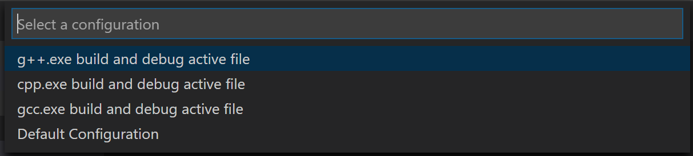
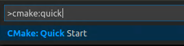
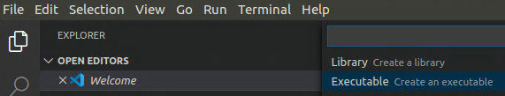

# VSCode开发教程

[toc]


## Windows

### 安装mingw-w64

下载地址：https://sourceforge.net/projects/mingw-w64/

过程参考：https://www.cnblogs.com/TAMING/p/9945389.html

### vscode安装插件

- chinese(simplified)
- C/C++
- Code Runner

过程参考：https://zhuanlan.zhihu.com/p/77645306

### 使用MinGW的GCC

翻译自[Using GCC with MinGW](https://code.visualstudio.com/docs/cpp/config-mingw)

记住MinGW和MinGW-w64不是一个东西（但作用差不多），他们俩有一段渊源。

#### 前提条件

1. 安装[Visual Studio Code](https://code.visualstudio.com/download)。
2. 安装插件[C/C++ extension for VS Code](https://marketplace.visualstudio.com/items?itemName=ms-vscode.cpptools)。在扩展插件页面（Ctrl+Shift+X）搜索'c++'安装C/C++扩展插件。


3. 通过SourceForge页面下载Mingw-w64。点击[Mingw-w64](https://sourceforge.net/projects/mingw-w64/files/Toolchains targetting Win32/Personal Builds/mingw-builds/installer/mingw-w64-install.exe/download)下载windos Mingw-w64 installer。
   1. 运行installer。
   2. 架构选择x86_64，然后选择next
   3. 再次继续next选择默认安装位置安装MinGW
4. 通过下列步骤将Mingw-w64`bin`目录添加到系统`PATH`环境变量下：
   1. 在Windows的搜索栏输入‘setting’打开Windows Settings
   2. 搜索栏搜索`编辑账户的环境变量`
   3. 选择`Path`变量点击**编辑**
   4. 选择**新建**添加Mingw-w64路径到系统path下。确切路径取决于您安装的Mingw-w64版本和安装位置。如果你使用前述Mingw-w64安装方式，添加这个路径：`C:\Program Files\mingw-w64\x86_64-8.1.0-posix-seh-rt_v6-rev0\mingw64\bin`
   5. 点击**确定**保存更新PATH。正常情况下需要重新打开windows控制台PATH路径才能生效。

#### 检查MinGW安装情况

要检查您的Mingw-w64工具是否已正确安装并可用，请打开新的命令提示符并键入：

```powershell
g++ --version
gdb --version
```

如果看不到预期的输出，或者`g ++`或`gdb`不是可识别的命令，请检查安装（Windows控制面板>程序），并确保PATH条目与编译器所在的Mingw-w64二进制位置匹配。

#### Hello World

在Windows命令提示符下，创建一个名为projects的空文件夹，您可以在其中放置所有VS Code项目。 然后创建一个名为helloworld的子文件夹，切换至该文件夹，并通过输入以下命令在该文件夹中打开VS Code：

```powershell
mkdir projects
cd projects
mkdir helloworld
cd helloworld
code .
```

命令"code ."在当前工作文件夹中打开VS Code，这将成为您的“工作空间”。 在阅读本教程的过程中，您将看到在工作区的.vscode文件夹中创建的三个文件：

- `tasks.json` (构建指令)
- `launch.json` (调试设置)
- `c_cpp_properties.json` (编译器路径和IntelliSense设置)

#### 添加源码文件

在文件资源管理器标题栏中，选择“**新建文件**”按钮，并将文件命名为`helloworld.cpp`。


#### 添加hello world源码

粘贴下面源码：

```c++
#include <iostream>
#include <vector>
#include <string>

using namespace std;

int main()
{
    vector<string> msg {"Hello", "C++", "World", "from", "VS Code", "and the C++ extension!"};

    for (const string& word : msg)
    {
        cout << word << " ";
    }
    cout << endl;
}
```

现在按Ctrl + S保存文件。 请注意，刚添加的文件如何显示在VS Code侧栏中的**文件资源管理器**视图（Ctrl + Shift + E）中：


您还可以通过选中“文件”主菜单中的“自动保存”，启用“自动保存”以自动保存文件更改。

最左侧的活动栏使您可以打开不同的视图，例如搜索，源代码管理和运行。 您将在本教程后面的“运行”视图中查看。 您可以在VS Code用户界面文档中找到有关其他视图的更多信息。

> 注意：保存或打开C ++文件时，您可能会看到来自C / C ++扩展名的有关Insiders版本可用性的通知，该通知可让您测试新功能和修复。 您可以通过选择X（清除通知）来忽略此通知。

#### 探索 IntelliSense

在新的helloworld.cpp文件中，将鼠标悬停在矢量或字符串上以查看类型信息。 在声明msg变量之后，开始键入msg。 就像调用成员函数时一样。 您应该立即看到一个显示所有成员函数的完成列表，以及一个显示msg对象的类型信息的窗口：


您可以按Tab键插入选定的成员。 然后，当您添加左括号时，您将看到有关该函数所需的任何参数的信息。

#### 构建helloworld.cpp

接下来，您将创建一个task.json文件来告诉VS Code如何构建（编译）程序。 该任务将调用g ++编译器以基于源代码创建可执行文件。

在主菜单中，选择“**终端>配置默认生成任务**”。 在下拉列表中，将显示任务下拉列表，其中列出了C ++编译器的各种预定义构建任务。 选择**g ++.exe build active file**，它将构建编辑器中当前显示（活动）的文件。


这将在.vscode文件夹中创建一个task.json文件，并在编辑器中将其打开。

您的新task.json文件应类似于以下JSON：

```json
{
  "version": "2.0.0",
  "tasks": [
    {
      "type": "shell",
      "label": "C/C++: g++.exe build active file",
      "command": "C:\\Program Files\\mingw-w64\\x86_64-8.1.0-posix-seh-rt_v6-rev0\\mingw64\\bin\\g++.exe",
      "args": ["-g", "${file}", "-o", "${fileDirname}\\${fileBasenameNoExtension}.exe"],
      "options": {
        "cwd": "${workspaceFolder}"
      },
      "problemMatcher": ["$gcc"],
      "group": {
        "kind": "build",
        "isDefault": true
      }
    }
  ]
}
```

命令设置指定要运行的程序； 在这种情况下是g ++。 args数组指定将传递给g ++的命令行参数。 必须按照编译器期望的顺序指定这些参数。 该任务告诉g ++获取活动文件（$ {file}），对其进行编译，并在当前目录（$ {fileDirname}）中创建一个与活动文件同名但扩展名为.exe（$）的可执行文件。 {fileBasenameNoExtension} .exe），则生成示例的helloworld.exe。

> 注意：您可以在[变量参考](https://code.visualstudio.com/docs/editor/variables-reference)中了解有关`task.json`变量的更多信息。

`label`值是您将在任务列表中看到的值； 您可以随意命名。

`group`中的“ isDefault”：true值指定当您按Ctrl + Shift + B时将运行此任务。 此属性仅出于方便起见； 如果将其设置为false，仍然可以从“终端”菜单中使用“任务：运行构建任务”来运行它。

##### 运行构建

1. 返回**helloworld.cpp**。 您的任务将构建活动文件，并且您将要构建**helloworld.cpp**。

2. 要运行`task.json`中定义的构建任务，请按**Ctrl + Shift + B**或从主菜单中选择**终端**的“**运行生成任务**”。

3. 任务开始时，您应该看到源代码编辑器下方显示了“集成终端”面板。 任务完成后，终端将显示编译器的输出，指示构建成功还是失败。 对于成功的g ++构建，输出看起来像这样：

   
   
4. 使用+按钮创建一个新终端，您将拥有一个新终端，其中**helloworld**文件夹为工作目录。 运行**dir**，您现在应该看到可执行文件**helloworld.exe**。

   
5. 您可以通过键入`helloworld.exe`（或`.\ helloworld.exe`，如果使用PowerShell终端）在终端中运行`helloworld`。

> 注意：最初可能需要几次按Enter键才能在终端中看到PowerShell提示。 Windows的将来版本中应解决此问题。

##### 修改task.json

您可以使用“ **$ {workspaceFolder} \\\\ *.cpp**”之类的参数而不是**$ {file}**来修改**task.json**以构建多个C ++文件。 这将在当前文件夹中生成所有**.cpp**文件。 您也可以通过将“ **$ {fileDirname} \\\\ $ {fileBasenameNoExtension} .exe**”替换为硬编码的文件名（例如“ **$ {workspaceFolder} \\\\ myProgram.exe**”）来修改输出文件名。

#### 调试helloworld.cpp

接下来，您将创建一个`launch.json`文件，以配置VS Code以在您按`F5`调试程序时启动GDB调试器。

1. 从主菜单中，选择“运行”>“添加配置...”，然后选择“ C ++（GDB / LLDB）”。

2. 然后，您将看到各种预定义调试配置的下拉列表。 选择**g ++.exe build and debug active file**。



VS Code creates a `launch.json` file, opens it in the editor, and builds and runs 'helloworld'.

```json
{
  "version": "0.2.0",
  "configurations": [
    {
      "name": "g++.exe - Build and debug active file",
      "type": "cppdbg",
      "request": "launch",
      "program": "${fileDirname}\\${fileBasenameNoExtension}.exe",
      "args": [],
      "stopAtEntry": false,
      "cwd": "${workspaceFolder}",
      "environment": [],
      "externalConsole": false,
      "MIMode": "gdb",
      "miDebuggerPath": "C:\\Program Files\\mingw-w64\\x86_64-8.1.0-posix-seh-rt_v6-rev0\\mingw64\\bin\\gdb.exe",
      "setupCommands": [
        {
          "description": "Enable pretty-printing for gdb",
          "text": "-enable-pretty-printing",
          "ignoreFailures": true
        }
      ],
      "preLaunchTask": "C/C++: g++.exe build active file"
    }
  ]
}
```

`program`设置指定要调试的程序。 在这里，它被设置为活动文件文件夹`$ {fileDirname}`和扩展名为`.exe`的活动文件 `$ {fileBasenameNoExtension} .exe`，如果**helloworld.cpp**是活动文件，则活动文件名为**helloworld.exe**。

默认情况下，C ++扩展不会在您的源代码中添加任何断点，并且`stopAtEntry`值设置为**false**。

将`stopAtEntry`值更改为**true**，以使调试器在启动调试时在**main**方法上停止。

> 注意：`preLaunchTask`设置用于指定启动前要执行的任务。 确保它与`task.json`文件标签设置一致。

##### 开始调试会话

1. 返回`helloworld.cpp`，使其成为活动文件。
2. 按**F5**或从主菜单中选择“**运行”>“启动调试**”。 在开始浏览源代码之前，让我们花一点时间注意用户界面中的一些更改：

- 集成终端出现在源代码编辑器的底部。 在“调试输出”选项卡中，您将看到指示调试器已启动并正在运行的输出。
- 下图编辑器突出显示**main**方法中的第一条语句。 这是C ++扩展自动为您设置的断点：


- 左侧的“运行”视图显示调试信息。 您将在本教程的后面看到一个示例。
- 在代码编辑器的顶部，将显示一个调试控制面板。 您可以通过抓住左侧的点在屏幕上移动它。

##### 单步执行代码

现在，您准备开始逐步执行代码。

1. 单击或按调试控制面板中的“跳过”图标。

   

   这会将程序执行推进到for循环的第一行，并跳过在创建和初始化**msg**变量时调用的**vector**和**string**类中的所有内部函数调用。 注意左侧“**变量**”窗口中的更改。

   

   在这种情况下，将出现错误，因为尽管调试器现在可以看到循环的变量名，但是该语句尚未执行，因此此时无任何内容可读取。 但是，**msg**的内容是可见的，由于该语句已完成。

2. 再次按**Step over**前进到该程序中的下一条语句（跳过为初始化循环而执行的所有内部代码）。 现在，“**变量**”窗口显示有关循环变量的信息。

3. 再次按**Step over**执行`cout`语句。 （请注意，自2019年3月发行版起，直到循环退出，C ++扩展才将任何输出打印到**调试控制台**。）

4. 如果愿意，可以继续按**Step over**，直到将引导程序中的所有单词都打印到控制台为止。 但是，如果您感到好奇，请尝试按“**跳入**”按钮以逐步浏览C ++标准库中的源代码！

   

   要返回自己的代码，一种方法是按住“**跳过**”。 另一种方法是通过在代码编辑器中切换到**helloworld.cpp**选项卡，将插入点放在循环内的`cout`语句中的某个位置，然后按**F9**来在代码中设置断点。 在左侧的装订线中出现一个红点，指示已在此行上设置断点。

   

   然后按**F5**键从标准库标题中的当前行开始执行。 执行将中断。 如果愿意，可以再次按**F9**键以关闭断点。

   循环完成后，您可以在**Integrated Terminal**中看到输出以及**GDB**输出的其他一些诊断信息。

##### 设置监控

有时，您可能希望在程序执行时跟踪变量的值。 您可以通过在变量上设置监视来做到这一点。

1. 将插入点放在循环内。 在“**监视**”窗口中，单击加号，然后在文本框中键入`word`，这是循环变量的名称。 现在，当您逐步执行循环时，请查看“**监视**”窗口。

   

2. 通过在循环之前添加以下语句来添加另一个监控：`int i = 0`;。 然后，在循环内部添加以下语句：`++ i`;。 现在像上一步一样添加监控变量**i**。

3. 要在断点处暂停执行时快速查看任何变量的值，可以使用鼠标指针悬停在其上。

   

#### C / C ++配置

如果您想进一步控制C / C ++扩展，可以创建一个`c_cpp_properties.json`文件，该文件可让您更改设置，例如编译器的路径，包含路径，C ++标准（默认为C ++ 17）和更多。

您可以通过运行命令`C / C ++`来查看C / C ++配置UI：从命令面板（**Ctrl + Shift + P**）中运行命令**C/C++:Edit configuratiions（UI）**。


这将打开“ **C / C ++配置**”页面。 当您在此处进行更改时，VS Code将它们写入**.vscode**文件夹中名为**c_cpp_properties.json**的文件中。

在这里，我们将“**配置**”名称更改为**GCC**，将“**编译器路径**”下拉列表设置为**g ++编译器**，并设置了**IntelliSense模式**以匹配编译器（**gcc-x64**）


Visual Studio Code将这些设置放在**.vscode \ c_cpp_properties.json**中。 如果直接打开该文件，则它应如下所示：

```c++
{
  "configurations": [
    {
      "name": "GCC",
      "includePath": ["${workspaceFolder}/**"],
      "defines": ["_DEBUG", "UNICODE", "_UNICODE"],
      "windowsSdkVersion": "10.0.18362.0",
      "compilerPath": "C:/Program Files/mingw-w64/x86_64-8.1.0-posix-seh-rt_v6-rev0/mingw64/bin/g++.exe",
      "cStandard": "c11",
      "intelliSenseMode": "gcc-x64"
    }
  ],
  "version": 4
}
```

仅当程序包含工作空间或标准库路径中没有的头文件时，才需要添加到“`includePath`”设置。

##### 编译路径

该扩展使用`compilerPath`设置来推断C ++标准库头文件的路径。 当扩展知道在哪里可以找到这些文件时，它可以提供诸如智能补全和“**转到定义**”导航之类的功能。

C / C ++扩展尝试根据在系统上找到的内容，使用默认的编译器位置填充`compilePath`。 该扩展在几个常见的编译器位置中查找。

`compilerPath`搜索顺序为：

- 首先检查Microsoft Visual C ++编译器
- 然后在Windows Subsystem for Linux（WSL）上寻找g ++
- 然后是用于Mingw-w64的g ++

如果安装了Visual Studio或WSL，则可能需要更改`compilerPath`以匹配项目的首选编译器。 例如，如果使用i686架构，Win32线程和sjlj异常处理安装选项安装Mingw-w64版本8.1.0，则路径应如下所示：`C：\ Program Files（x86）\ mingw-w64 \ i686- 8.1.0-win32-sjlj-rt_v6-rev0`。

### 在Linux上开始使用CMake工具

翻译自[Get started with CMake Tools on Linux](https://code.visualstudio.com/docs/cpp/cmake-linux)

CMake是一个开放源代码，跨平台的工具，它使用与编译器和平台无关的配置文件来生成特定于您的编译器和平台的本机生成工具文件。

CMake Tools扩展集成了Visual Studio Code和CMake，可轻松配置，构建和调试C ++项目。

在本教程中，您将使用Visual Studio Code的CMake工具扩展，在Linux上配置，构建和调试简单的C ++ CMake项目。 除了安装CMake，编译器，调试器和构建工具外，本教程中的步骤通常适用于在其他平台（例如Windows）上使用CMake的方式。

如果有任何问题，请在VS Code文档库中提交本教程的问题。

#### **前提条件**

1. [Visual Studio Code](https://code.visualstudio.com/download).

2. [C++ extension for VS Code](https://marketplace.visualstudio.com/items?itemName=ms-vscode.cpptools)。 通过在“扩展”视图（Ctrl + Shift + X）中搜索“ c ++”来安装。

   

3. [CMake Tools extension for VS Code](https://marketplace.visualstudio.com/items?itemName=ms-vscode.cmake-tools)。 通过在“扩展”视图（Ctrl + Shift + X）中搜索“ CMake工具”来安装。

4. 您还需要安装CMake，编译器，调试器和构建工具。

#### 确保已安装CMake

VS Code CMake Tools扩展通过使用系统上安装的CMake来完成其工作。 为了获得最佳效果，请使用CMake 3.15或更高版本。
查看系统上是否已安装CMake。 打开“终端”窗口，然后输入以下命令：

```shell
cmake --version
```

要安装CMake，或者如果你的CMake低于3.15版本，则要获取更高版本，请参阅[Kitware APT Repository](https://apt.kitware.com/)存储库中适用于您平台的说明。 安装3.15或更高版本。

#### 确保已安装开发工具

虽然使用VS Code编辑源代码，但仍可使用系统上安装的编译器，调试器和构建工具（例如`make`）来编译和调试源代码。

在Ubuntu上的本教程中，我们将使用GCC编译器，GDB进行调试，`make`进行构建项目。 这些工具默认未安装在Ubuntu上，因此您需要安装它们。 幸运的是，这很容易。

#### 检查是否安装了GCC

要查看您的系统上是否已安装GCC，请打开“终端”窗口并输入以下命令：

```shell
gcc -v
```

如果未安装GCC，请在“终端”窗口中运行以下命令以更新Ubuntu软件包列表。 过时的Linux发行版可能会干扰获取最新软件包。

```sell
sudo apt-get update
```

接下来，使用以下命令安装GNU编译器，make和GDB调试器：

```shell
sudo apt-get install build-essential gdb
```

#### 创建一个CMake项目

如果您现有的CMake项目的根目录中已经有`CMakeLists.txt`文件，则可以跳至“[选择工具包](#选择工具包)”以配置现有项目。

否则，为新项目创建一个文件夹。 在“终端”窗口中，创建一个名为**cmakeQuickStart**的空文件夹，切换至该文件夹，然后通过输入以下命令在该文件夹中打开VS Code：

```sell
mkdir cmakeQuickStart
cd cmakeQuickStart
code .
```

`code.`命令在当前工作文件夹中打开VS Code，这将成为您的“工作空间”。

#### 创建一个CMake Hello World项目

CMake Tools扩展可以为您创建基本CMake项目的文件。 打开命令面板（Ctrl + Shift + P）并运行**CMake: Quick Start**命令：



输入项目名称。 这将被写入**CMakeLists.txt**和一些初始源文件。

接下来，选择“可执行文件”作为项目类型，以创建包含基本**main()**函数的基本源文件（**main.cpp**）。



> 注意：如果只想要创建基本的源文件和头文件，则应选择**Library**。 但是对于本教程，**Executable**就可以。 如果系统提示您为文件夹配置IntelliSense，请选择“**允许**”。

这将创建一个hello world CMake项目，其中包含**main.cpp**，**CMakeLists.txt**（告诉CMake工具如何构建您的项目）以及一个名为**build**的文件夹，用于构建文件：


#### 选择工具包

在使用CMake Tools扩展构建项目之前，您需要对其进行配置，以了解系统上的编译器。 通过扫描“工具包”来做到这一点。 工具包代表一个工具链，它是用于构建项目的编译器，链接器和其他工具。 要扫描工具包：

1. 打开命令面板（Ctrl + Shift + P）并运行CMake：**CMake: Select a Kit**。 该扩展名将自动在您的计算机上扫描套件，并创建在系统上找到的编译器列表。

2. 选择您要使用的编译器。 例如，根据所安装的编译器，您可能会看到类似以下内容的信息：

   

### 配置Hello World

配置CMake项目必须做两件事：选择一个工具包（您刚刚做了）和选择一个变量。

先前选择的工具包显示在状态栏中。 例如：


要更改工具包件，您可以单击状态栏中的套件，或运行**CMake: Select a kit**从命令面板中再次选择套件命令。 如果没有找到所需的编译器，则可以在项目中编辑**cmake-tools-kits.json**文件。 要编辑文件，请打开命令面板（Ctrl + Shift + P）并运行**CMake: Edit User-Local CMake Kits**命令。

##### 选择一个变量

一个变量包含有关如何构建项目的说明。 默认情况下，CMake Tools扩展提供四个变体，每个变体对应于默认的构建类型：**Debug**，**Release**，**MinRelSize**和**RelWithDebInfo**。 这些选项执行以下操作：

**Debug**：禁用优化并包含调试信息。**Release**：包括优化，但没有调试信息。 **MinRelSize**：优化尺寸。 没有调试信息。 **RelWithDebInfo**：优化速度并包括调试信息。


选择**Debug**将调试信息包含在你编译的版本。


所选的变量将显示在活动工具包旁边的状态栏中。

##### CMake：配置
现在，您已经选择了一个工具包和一个变量，打开命令面板（Ctrl + Shift + P）并运行**CMake: Configure**命令来配置您的项目。 这将使用您选择的工具包和变量在项目的构建文件夹中生成构建文件。

#### 构建hello world

配置项目后，就可以开始构建了。 打开命令面板（Ctrl + Shift + P）并运行**CMake: Build**，或从状态栏中选择**Build**按钮。

#### 调试hello world

要运行和调试项目，请打开**main.cpp**，并在`std::cout`行上放置一个断点。 然后打开命令面板（Ctrl + Shift + P）并运行**CMake: Debug**。 调试器将在`std::cout`行上停止：


继续执行按F5继续。

现在，您已经使用VS Code CMake Tools扩展来使用CMake在Ubuntu上构建和调试C ++应用程序。 其他平台的步骤相同； 区别在于如何安装CMake以及所选平台的编译器/调试器。 有关为其他平台设置编译器/调试器的说明，请参见以下内容：

- [Microsoft C++ on Windows](https://code.visualstudio.com/docs/cpp/config-msvc)
- [Clang on macOS](https://code.visualstudio.com/docs/cpp/config-clang-mac)
- [GCC on Windows Subsystem for Linux](https://code.visualstudio.com/docs/cpp/config-wsl)