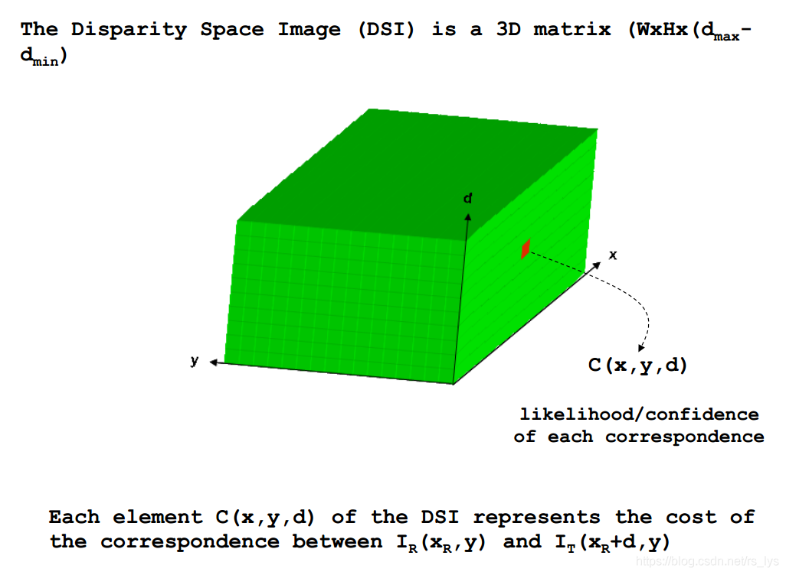
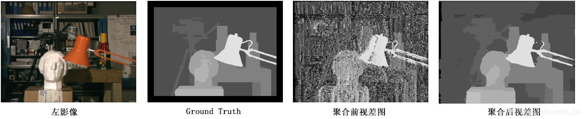
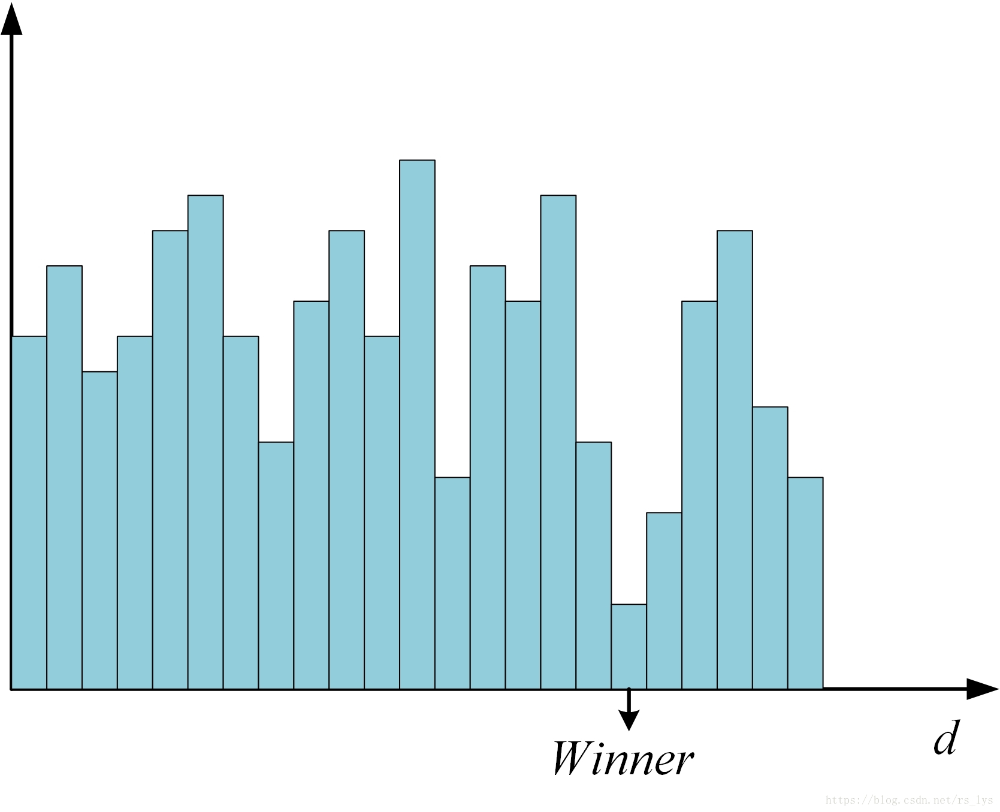
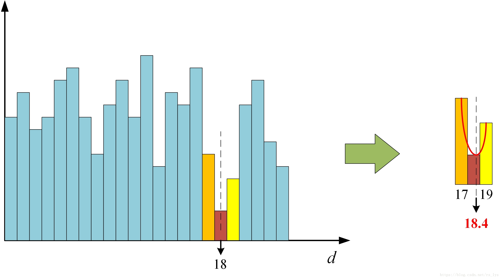

> 作者：李迎松
>
> 复制来源：https://blog.csdn.net/rs_lys/article/details/83302323

# 双目立体匹配步骤详解

​		根据Schrstein和Szeliski的总结，双目立体匹配可划分为四个步骤：**匹配代价计算、代价聚合、视差计算和视差优化**。

## Step1 匹配代价计算

**匹配代价计算**的目的是衡量待匹配像素与候选像素之间的相关性。两个像素无论是否为同名点，都可以通过匹配代价函数计算匹配代价，代价越小则说明相关性越大，是同名点的概率也越大。

  每个像素在搜索同名点之前，往往会指定一个视差搜索范围D（Dmin ~ Dmax）,视差搜索时将范围限定在D内，用一个大小为W×H×D（W为影像宽度，H为影像高度）的三维矩阵C来存储每个像素在视差范围内每个视差下的匹配代价值。矩阵C通常称为DSI（Disparity Space Image）。

  匹配代价计算的方法有很多，传统的摄影测量中，使用灰度绝对值差（AD，Absolute Differences）[1](https://blog.csdn.net/rs_lys/article/details/83302323#fn1)、灰度绝对值差之和（SAD，Sum of Absolute Differences）、归一化相关系数（NCC，Normalized Cross-correlation）等方法来计算两个像素的匹配代价；计算机视觉中，多使用互信息（MI，Mutual Information）法[2](https://blog.csdn.net/rs_lys/article/details/83302323#fn2) [3](https://blog.csdn.net/rs_lys/article/details/83302323#fn3)、Census变换（CT，Census Transform）法[4](https://blog.csdn.net/rs_lys/article/details/83302323#fn4) [5](https://blog.csdn.net/rs_lys/article/details/83302323#fn5)、Rank变换（RT, Rank Transform）法[6](https://blog.csdn.net/rs_lys/article/details/83302323#fn6) [7](https://blog.csdn.net/rs_lys/article/details/83302323#fn7)、BT（Birchfield and Tomasi）法[8](https://blog.csdn.net/rs_lys/article/details/83302323#fn8) 等作为匹配代价的计算方法。不同的代价计算算法都有各自的特点，对各类数据的表现也不尽相同，选择合适的匹配代价计算函数是立体匹配中不可忽视的关键步骤。

**图1 DSI示意图（C(x,y,d)代表像素(x,y)在视差为d时的匹配代价）**

## Step2 代价聚合

​		**代价聚合**的根本目的是让代价值能够准确的反映像素之间的相关性。上一步匹配代价的计算往往只会考虑局部信息，通过两个像素邻域内一定大小的窗口内的像素信息来计算代价值，这很容易受到影像噪声的影响，而且当影像处于弱纹理或重复纹理区域，这个代价值极有可能无法准确的反映像素之间的相关性，直接表现就是真实同名点的代价值非最小。

  而代价聚合则是建立邻接像素之间的联系，以一定的准则，如相邻像素应该具有连续的视差值，来对代价矩阵进行优化，这种优化往往是全局的，每个像素在某个视差下的新代价值都会根据其相邻像素在同一视差值或者附近视差值下的代价值来重新计算，得到新的DSI，用矩阵S来表示。

  实际上代价聚合类似于一种视差传播步骤，信噪比高的区域匹配效果好，初始代价能够很好的反映相关性，可以更准确的得到最优视差值，通过代价聚合传播至信噪比低、匹配效果不好的区域，最终使所有影像的代价值都能够准确反映真实相关性。常用的代价聚合方法有扫描线法、动态规划法、SGM算法中的路径聚合法等。

**图1：代价聚合前后视差图示意图**

## Step3 视差计算

​		**视差计算**即通过代价聚合之后的代价矩阵S来确定每个像素的最优视差值，通常使用赢家通吃算法（WTA，Winner-Takes-All）来计算，如图2所示，即某个像素的所有视差下的代价值中，选择最小代价值所对应的视差作为最优视差。这一步非常简单，这意味着聚合代价矩阵S的值必须能够准确的反映像素之间的相关性，也表明上一步代价聚合步骤是立体匹配中极为关键的步骤，直接决定了算法的准确性。

**图2 赢家通吃（WTA）算法示意图**

## Step4 视差优化

​		**视差优化**的目的是对上一步得到的视差图进行进一步优化，改善视差图的质量，包括剔除错误视差、适当平滑以及子像素精度优化等步骤，一般采用左右一致性检查（Left-Right Check）算法剔除因为遮挡和噪声而导致的错误视差；采用剔除小连通区域算法来剔除孤立异常点；采用中值滤波（Median Filter）、双边滤波（Bilateral Filter）等平滑算法对视差图进行平滑；另外还有一些有效提高视差图质量的方法如鲁棒平面拟合（Robust Plane Fitting）、亮度一致性约束（Intensity Consistent）、局部一致性约束（Locally Consistent）等也常被使用。

  由于WTA算法所得到的视差值是整像素精度，为了获得更高的子像素精度，需要对视差值进行进一步的子像素细化，常用的子像素细化方法是一元二次曲线拟合法，通过最优视差下的代价值以及左右两个视差下的代价值拟合一条一元二次曲线，取二次曲线的极小值点所代表的视差值为子像素视差值。如图3所示。

- 局部匹配算法：步骤一般包括**匹配代价计算**、**代价聚合**和**视差计算**三个步骤
- 全局算法：包括**匹配代价计算**，**视差计算**与**视差优化**三个步骤
- 半全局算法：SGM则四个步骤都有

1. KANADE T, KANO H, KIMURA S, et al. Development of a video-rate stereo machine: Ieee/rsj International Conference on Intelligent Robots and Systems 95. ‘human Robot Interaction and Cooperative Robots’, Proceedings, 2002[C]. 
2. KIM J, KOLMOGOROV V, ZABIH R. Visual Correspondence Using Energy Minimization and Mutual Information: IEEE International Conference on Computer Vision, 2003. Proceedings, 2008[C]. 
3. EGNAL G. Mutual Information as a Stereo Correspondence Measure[J]. Technical Reports, 2000.
4. MA L, LI J, MA J, et al. A Modified Census Transform Based on the Neighborhood Information for Stereo Matching Algorithm: Seventh International Conference on Image and Graphics, 2013[C]. 
5. BAIK Y K, JO J H, LEE K M. Fast Census Transform-based Stereo Algorithm using SSE2: The 12th Korea-Japan Joint Workshop on Frontiers of Computer Vision, Tokushima, Japan, 2006[C]. 
6. GU Z, SU X, LIU Y, et al. Local stereo matching with adaptive support-weight, rank transform and disparity calibration[J]. Pattern Recognition Letters, 2008,29(9):1230-1235. 
7. BANKS J, BENNAMOUN M, KUBIK K, et al. A constraint to improve the reliability of stereo matching using the rank transform: Acoustics, Speech, and Signal Processing, 1999. on 1999 IEEE International Conference, 1999[C].
8. BIRCHFIELD S, TOMASI C. A Pixel Dissimilarity Measure That Is Insensitive to Image Sampling[J]. IEEE Transactions on Pattern Analysis & Machine Intelligence, 1998,20(4):401-406.